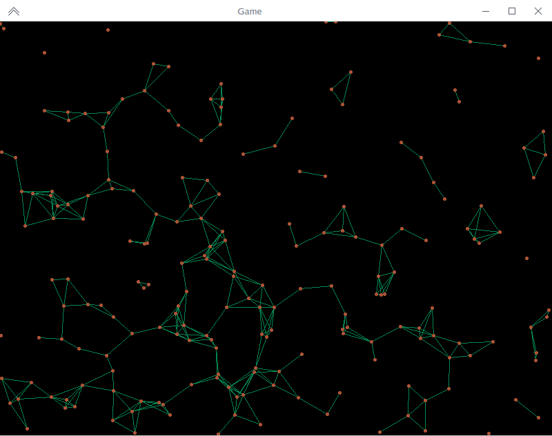

# Particles Nim
A simple particles procedural animation using Nim Language + Nico.


### Build from source

```bash
# install project dependencies
$ nimble install

# generate the optimized release build
$ nimble release
```

**Note**: Ensure that the latet version of [Nim](https://nim-lang.org/) programming language (with its tooling) is installed on the system.


### Usage

```
Arguments:
        -p, --particles Number of particles to simulate
        -s, --speed     Particle speed factor
        -d, --distance  Distance threshold for line rendering

Example: particles -p=500 -s=2 -d=50
```

### Screenshot

